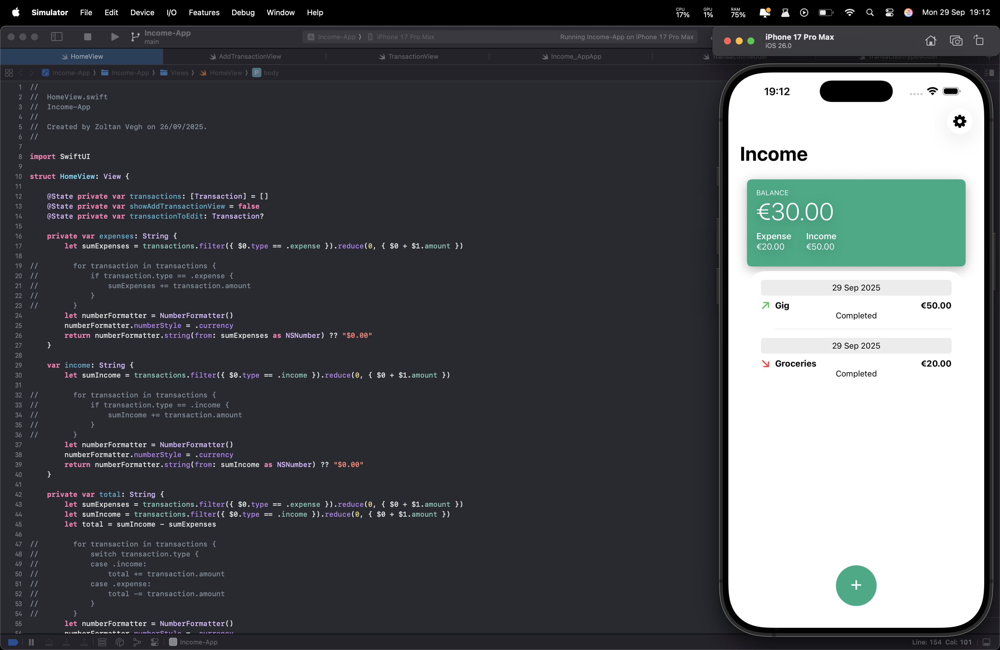
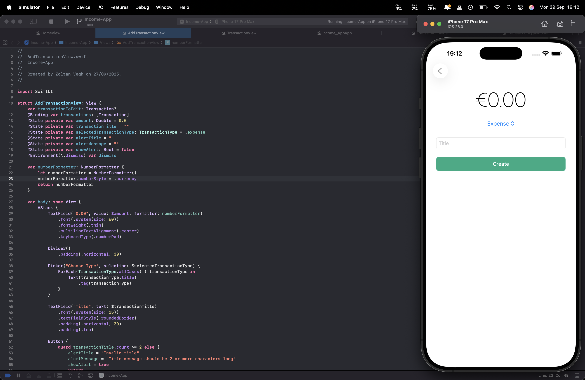

# Income & Expense Tracker (SwiftUI)

A simple **Income & Expense Tracker** built with SwiftUI.  
Users can **add incomes and expenses, edit or delete them**, and the app automatically updates the **balance**.  

---

## Features
- Add new **income** or **expense**  
- Edit existing entries  
- Delete entries with a swipe  
- Real-time balance updates  
- Clean and modern **SwiftUI** interface  

---

## Screenshots

<p align="center">
  
  
</p>

---

## Getting Started

### Requirements
- iOS 17+
- Xcode 15+

### Installation
1. Clone the repo:
   ```bash
   git clone https://github.com/your-username/income-tracker-swiftui.git
